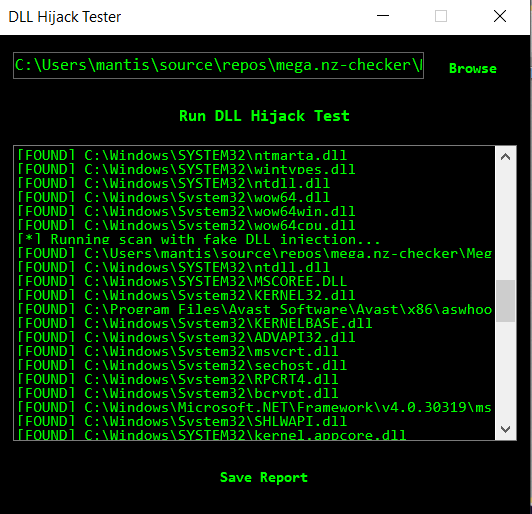

# DLL Hijack Tester

**DLL Hijack Tester** is a lightweight Windows Forms application that helps security researchers and pentesters identify potential DLL Hijacking vulnerabilities in Windows executables.

## 🧪 Features

- Run-time DLL Hijack testing against any `.exe` file
- Injects a dummy DLL and detects if it is loaded
- Custom `ListBox` with color-coded results:
  - 🟢 Safe (default)
  - 🔴 `[MISSING]` DLLs not found
  - 🟠 `[HIJACKED]` dummy DLL was loaded
- Simple Matrix-style UI (green on black)
- Save results as a text report

## 📷 Screenshot

 

## 🛠️ How It Works

1. Browse and select a target `.exe` file
2. The app scans the executable's directory for commonly hijacked DLL names
3. It injects a test DLL into a temp folder and modifies the `PATH`
4. The executable is run in a controlled environment
5. Output is analyzed to detect hijack conditions

## 📁 Output Format

Each DLL result is printed as:

[STATUS] DLLName.dll — Description or path

Where `[STATUS]` is either:
- `[OK]`
- `[MISSING]`
- `[HIJACKED]`

## 💾 Save Report

Click **Save Report** to export the results to a `.txt` file.

## 📦 Build Instructions

- Visual Studio 2019 or later
- .NET Framework 4.7.2 (or adjust as needed)
- No external dependencies

## ⚠️ Disclaimer

This tool is intended **only for educational and ethical testing purposes**. Do not use it on systems you do not own or have explicit permission to test.

